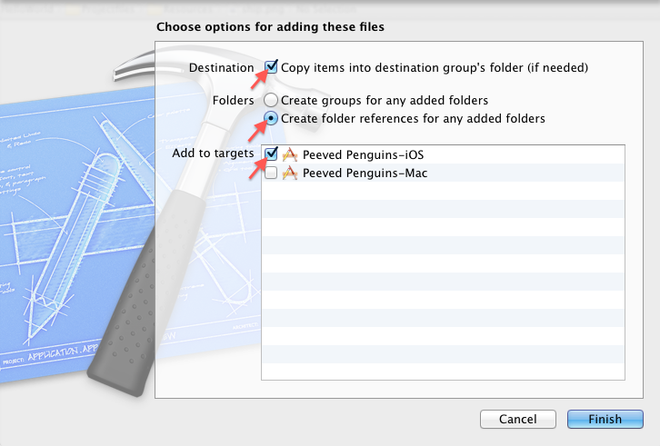

---
title: "XCode Lessons"
slug: xcode-lessons
---     

**Xcode Lesson: Copying Files, Correctly**
Whenever you add or move a file or folder into a project, this window pops up. Make sure you always check off the boxes like below:

This applies even if you're moving files within Xcode.

"Copy items into destination group's folder" ensures that a copy of the file is physically added to the project folder.

"Create folder references for any added folders" ensures that folders are preserved.

"Add to targets" for iOS ensures that the file is included with the application when it is being compiled.

If you get a "Multiple errors occurred while copying the files" error, it usually means the files already exist in the project folder on your hard drive, even if they don't appear in Xcode. You'll need to look inside the project folder on your hard drive to see if the files you want are already there (and then you should add those files instead of the files you tried to add).
